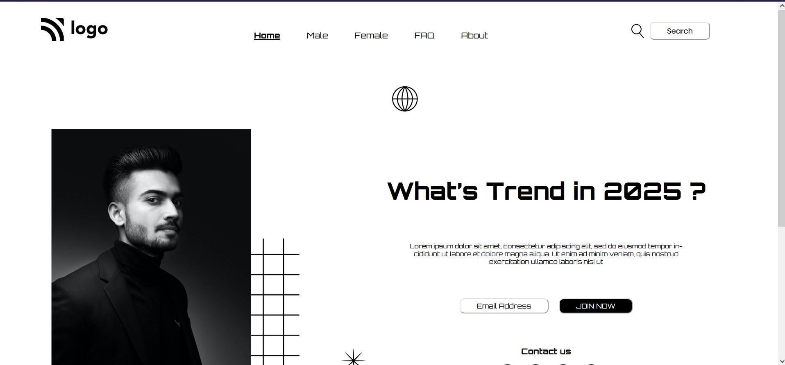

# Live_Class_Project1 -

This assignment was given as a task in [ineuron's](https://ineuron.ai/course/Full-Stack-JavaScript-Bootcamp-2.0) full stack javascript bootcamp by Hitesh Choudhary sir.

- This assignment was supposed to be done using only **postions** and no flexbox or grid.

- This project took around 3 hrs to complete.

## Tool/Technologies used -

- **Html**
- **Css**
- **Github**

&nbsp;

# Preview of the project-

**Learnings** - I had a thorough understanding about positions : **absolute** , **relative** , **fixed** and different css styles and properties
